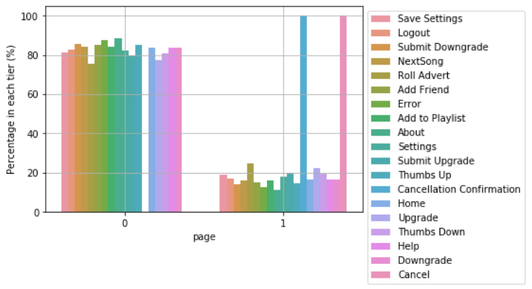
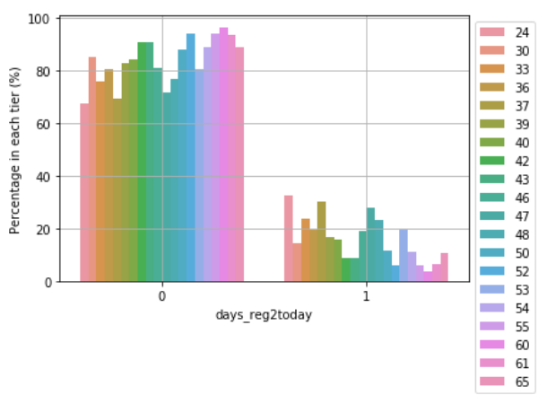
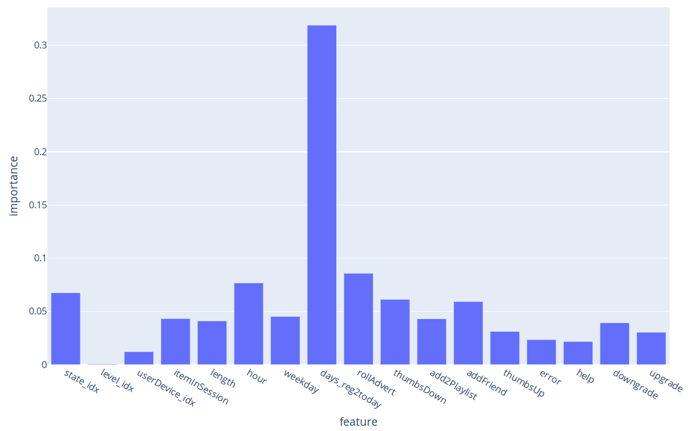
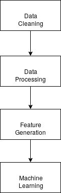

# Sparkify Project Report

## Project Description

### Background

Data are massively generated every day around the world, especially in the field of business related to the internet. The event data about users' actions can be analyzed, and the results can be some guides for making business decisions.

This project is the capstone project of Data Scientist Nanodegree. Udacity provides a dataset recording the events of each user in some periods, on which we can work.

### Project Workflow

The data of user interactions collected should be explored and use machine learning techniques to find some clues to predict which user in the future can churn so that we can take some measurements to prevent potential loss or gain more.

* Raw data from users are provided by Udacity
* The data should be first explored and cleaned
* The data engineering should be done, to generate features and labels
* Machine learning technique should be used to find some clues

## Raw Data Exploration

First of all, we should take a look at the raw data.

### Columns overview

After some coding for the exploration of the data, we get the following information.

| column |amount|type|explanation|n_null|
|---|---|---|---|---|
|artist|17656|str|name of musician|58392|
|auth|4|str|`Logged Out` `Cancelled` `Guest` `Logged In`|0|
|firstName|190|str||8346|
|gender|3|str||8346|
|itemInSession|1322|str||0|
|lastName|174|str||8346|
|length|14866|float||58392|
|level|2|str|`free` `paid`|0|
|location|115|str||8346|
|method|2|str|`PUT` `GET`|0|
|page|22|str||0|
|registration|226|int||8346|
|sessionId|2354|int||0|
|song|58481|str||58392|
|status|3|int||0|
|ts|277447|int||0|
|userAgent|57|str|browser name|8346|
|userId|226|int||0|

## Data Cleaning

* Columns `artist` `length` `song` have `NULL` values, but first, we keep the `NULL` values, because the `NULL` value may have some meanings.
* columns `firstName` `lastName` `userAgent` have `NULL` values, this indicates false records, so the rows will be removed

## Data Processing

The raw data should be studied and converted to more meaningful data.

### group `location` into `state`

The raw data in `location` consists of the city and the state. The letter string of state was extracted.

### calculate `days_reg2today` from `registration`

The raw data in `registration` is Unix timestamp. This was compared with the `ts` (the timestamp of current action) and then converted to a `datetime`. Finally, the days were extracted, which are the past days from the registration date to the event date. 

### extract `hour` and `weekday` from `ts` (`timestamp`) 

The raw data in `ts` are timestamp when acting. The hour and weekday were extracted from the timestamp.

### group `userAgent` into `userDevice`

The raw data in `userAgent` stored the browser and OS information. The OS that the user uses when acting is extracted and grouped into `Apple`, `Windows`, and `Linux`.

## Feature Generation

After the raw data were cleaned and modified, the features should be generated from the cleaned data.

Below is the barplot giving an overview of how the difference of the acting type can influence the result. That is why we generate some features according to the kind of actions, see the next part.

Similarly, we can see the relevance of the past days from registration to action is also nonnegligible.

* Other data visualizations can be found directly in the `Jupyter Notebook`.

### Features overview

| feature name | description | 
|---|---|
|`state`| the max count of the state this user is in when recording |
|`userDevice`|the most often OS the user uses|
|`level`|the level this user is in (most often level)|
|`itemInSession`|the average value of the raw data `itemInSession`|
|`length`|the average value of the raw data `length`|
|`hour`|the average value of the raw data `hour`|
|`weekday`|the average value of the raw data `weekday`|
|`days_reg2today`|the max value of the past days from the registration to today|
|`rollAdvert`|the count of all the actions `Roll Advert`|
|`thumbsDown`|the count of all the actions `Thumbs Down`|
|`add2playlist`|the count of all the actions `Add to Playlist`|
|`addFriend`|the count of all the actions `Add Friend`|
|`thumbsUp`|the count of all the actions `Thumbs Up`|
|`error`|the count of all the actions `Error`|
|`help`|the count of all the actions `Help`|
|`downgrade`|the count of all the actions `Downgrade`|
|`upgrade`|the count of all the actions `Upgrade`|

### label

* We defined if a user churned or not as when the event is a cancelation. (`page == Cancellation Confirmation`)
* `label` is the binary value of the column `churn`, indicating that whether this user churned or not.

## Machine Learning

### Metrics for Measurement of the Performance

#### Imbalanced Training Data

* In the training dataset, there are 44 records of not-churn users, but 147 records of churn users. This implies that training data distribution is imbalanced.
* I used `sample` method to add some data of not-churn users simply so that the number of the two classes (churn/not churn) is approximately equal.
* There are also some other methods to augment training data, which is useful when the data records are not sufficient.

#### Metrics Discussion

Below is the illustration of the metrics `precision` and `recall`, and `accuracy` is the total number of correct predictions divided by the total number of predictions made.

I chose `F1-Score` as the primary metric, due to that this metric considers both `precision` and `recall`. Below is the formula of `F1-Score`.

### Model estimation

* First, we made some estimations using different machine learning algorithms such as `logistic regression`, `random forest`, `gradient boosting`, to get an overview of how good the algorithm can be suitable for this problem.

* Then I selected the `random forest` algorithm to be used for this project, due to that the result of this algorithm outperformed other ones.

### Model training

I utilized the `grid search` and `cross-validation` to optimize the parameters of the `random forest` algorithm.

#### Parameter Tuning

I ran `<classifier>.extractParamMap()` method to get the description of the parameters from official documents.

* `minInfoGain`: Minimum information gain for a split to be considered at a tree node. The split should improve at least this much value of information gains if a node is to be split further. 
* `numTrees`: Number of trees to train.
* `max_depth`: Maximum depth of the tree. The trees can not be deeper as this value.
* `minInstancesPerNode`: Minimum number of instances each child must have after split. If a split causes the left or right child to have fewer than minInstancesPerNode, the split will be discarded as invalid.

The `grid search` for the hyperparameters is set as below: 

| parameter | grid values|
|---|---|
|`minInfoGain`|`[0, 1]`|
|`numTrees`|`[20, 30, 40]`|
|`maxDepth`|`[5, 8, 10]`|
|`minInstancesPerNode`|`[1, 2, 5]`|

The final parameters with the best `F1 Score` were chosen as follows:

| parameter | value|
|---|---|
|`minInfoGain`|0.0|
|`numTrees`|20|
|`maxDepth`|5|
|`minInstancesPerNode`|1|

### Result Discussion

The final training accuracy is `100.0%` and the `F-1` score is `1.0`. The classifier seems to be overfitting. The final metrics results on the test dataset are shown below:

| metric | value|
|---|---|
|F1 Score|0.69|
|Accuracy|73.5%|
|Precision|67%|
|Recall|73.5%|

From the test result above, the classifier does `not` predict the testing dataset well. The reason may be due to the lack of training data. There are only around 300 records in the training dataset. If we could train the classifier based on a relatively large dataset, the result could be much more reliable.

#### Feature Importance

Below is the barplot of the importance of different features according to the trained model.

From the graph above, we can see that the past days from the registration to this day when recording plays a significant role in determining whether a user churn or not. 

## Discussion

### Further steps 

* Further study of the `days_reg2today` should be made to get some glues to see whether the newly registered users or the regular users tend to churn.
   * when the regular users (bigger value in `days_reg2today`) tend to churn. The reason may be that the contents are not updated frequently enough, so that the users, who were playing with the out-dated contents provided, tend to churn.
   * when the newly registered users tend to churn. The reason may be that the contents at first glance are not attractive enough.

* More data could be collected.

* There could be more artificial features exacted from the raw data, to be studied, which could be relevant

* Multiple machine learning algorithms could be used and studied, to get more accurate results

## Reflection

This project is the capstone project by Udacity Data Scientist Nanodegree. The main processes of this project are shown below:

* In the data cleaning part, the raw data were preliminarily explored, and the meaningless data were removed.

* In the data processing part, the data were further in detail explored, and some of the data were converted to more meaningful data for the preparation of feature generation.

* In the feature generation part, the preprocessed data were further converted to ML-friendly training data (feature vector and label)

* In the machine learning part, I learned different metrics for the evaluation of the classification problem. I used a machine-learning algorithm to analyze the data, to find some interesting clues from the collected records data.

### Difficulties

The difficult parts of this project were:
* The processing of the data, and the generation of the features were not easy, one should dive deep into the raw data, and sometimes try to guess the meanings of the raw data.
* To get a satisfactory result from a machine learning algorithm is also tricky. This may due to my experience in ML, and the training data were also not sufficient enough.

### Interesting Aspects

The barplot of the importance of different features is very interesting. This particular point is extracted from the raw data, which could be an essential hint for further study, although the trained classifier cannot predict very well. At least there are worthful results from this data analysis.

## References

* [Spark Documentation `DataFrame`](https://spark.apache.org/docs/1.6.1/api/java/org/apache/spark/sql/DataFrame.html)
* [Spark Documentation `GroupedData`](https://spark.apache.org/docs/1.6.1/api/java/org/apache/spark/sql/GroupedData.html)
* [UDF in Pyspark (Stackoverflow question)](https://stackoverflow.com/questions/53630810/udf-and-python-function-in-pyspark)
* Udacity Data Scientist Nanodegree Courses
* [Youtube Siraj Random Forest](https://www.youtube.com/watch?v=QHOazyP-YlM)
* [Wiki F1 Score](https://en.wikipedia.org/wiki/F1_score)
* [Random Forest Parameters](https://www.cnblogs.com/pinard/p/6160412.html)
* [Spark Decision Trees Document](https://spark.apache.org/docs/2.2.0/mllib-decision-tree.html)