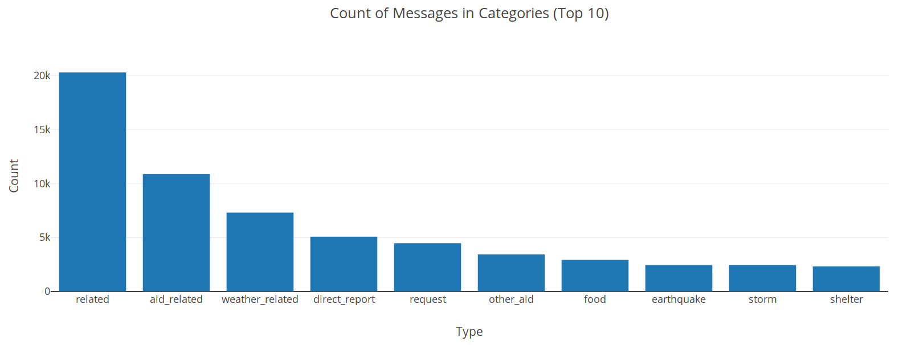
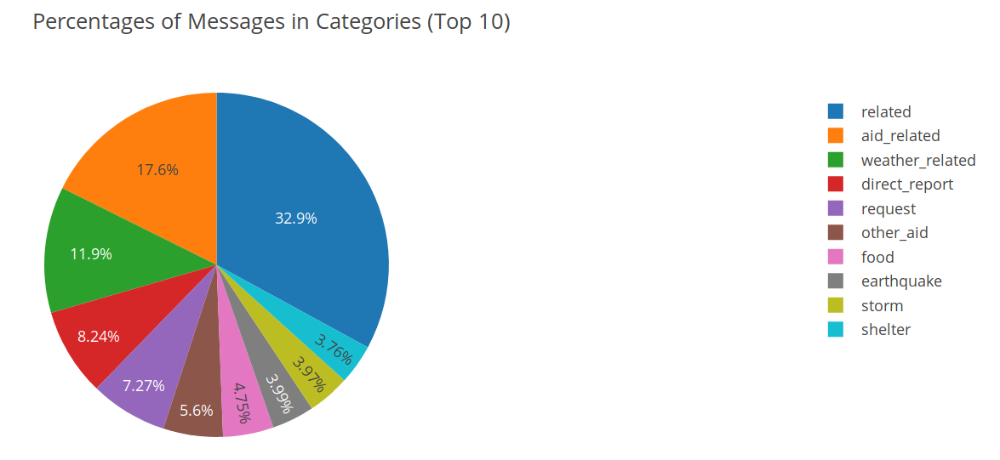
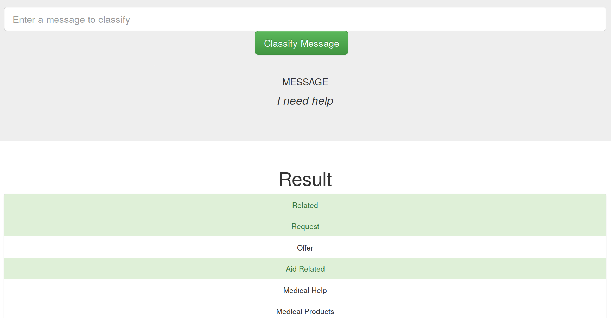

# Disaster Response Pipeline Project

### Folder Structure
```
.
├── img # store the images
├── data
│  ├── disaster_categories.csv
│  ├── disaster_messages.csv
│  └── process_data.py # ETL program
├── env.yml # environment setup
├── models
│  └── train_classifier.py # ML program
├── README.md
├── run.py # Flask Program
└── templates
  ├── go.html
  └── master.html
```

### Environment Setup

* Run in the terminal
```
conda env create --file env.yml
conda activate DSND
```

### ETL Pipeline
* To run ETL pipeline that cleans data and stores in the database
```
python data/process_data.py data/disaster_messages.csv data/disaster_categories.csv data/DisasterResponse.db
```
* Processes Description
 1. Merge the two datasets (`categories` and `messages`) based on `id`
 2. Clean the data
 * Split into different categories
 * Change the categories in numbers
 * Drop duplicates
 * Extract the names of the categories
 3. Save the data into a database
 
### ML Pipeline
* To run ML pipeline that trains a classifier and saves
```
python models/train_classifier.py data/DisasterResponse.db models/classifier.pkl
```
* ML processes description
 1. Load the data from the database and get the features and targets
 2. Tokenize the raw message data
 * Normalize the text (lowercase the letters, remove special chars)
 * Remove the stopwords
 * Lemmatize the words
 3. Build the ML pipeline
 * Transformer `CountVectorizer` applying `bag of words`
 * Transformer `TfidfTransformer` applying `tf-idf`, which stands for `term frequency-inverse document frequency`.
 * Estimator `MultiOutputClassifier` applying multi-output classifier
 * A grid search is applied over the whole pipeline
 4. Train the model using the training dataset
 5. Evaluation of the model using the test dataset
 6. Save the trained model into a `pickle` file
* To prevent the `data leakage` (Test dataset is trained when applying `cross-validation`), 
the data are split into a training dataset and test dataset before the training process.
The training dataset and the test dataset are separably fed into the model when needed.
 
### Web App
* To run the Flask web app
```
python run.py
```
* Go to http://0.0.0.0:3001/ in the browser
* Some Screenshots
 * Below is the counts of the training messages in different categories (top 10).
 
 * Below is the percentage of training messages in different categories (top 10)
 
 * If we type in a new message, and click `classify message`, the types predicted are highlighted as shown below
 